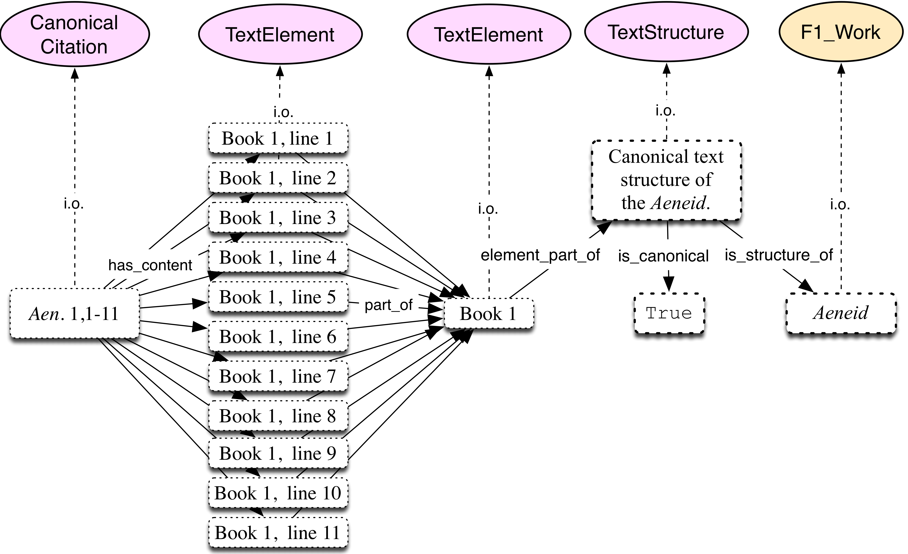

Data model
==========

The data model of ``hucitlib``'s knowledge base is based on the following ontologies:

1. `CIDOC-CRM <http://www.cidoc-crm.org/>`_
2. `FRBRoo <http://www.cidoc-crm.org/frbroo/>`_
3. `HuCit <http://www.essepuntato.it/lode/owlapi/http://purl.org/net/hucit>`_

In fact, the rationale for developing this data model was to re-use as
much as possible already existing and widely adopted ontologies, and to extend
them by means of new classes and properties only when absolutely necessary.

The first two ontologies that form the backbone of the HuCit knowledge base
are `CIDOC-CRM <http://www.cidoc-crm.org/>`_ and `FRBRoo <http://www.cidoc-crm.org/frbroo/>`_.
The `CIDOC-CRM <http://www.cidoc-crm.org/>`_ is a conceptual model that
was born as a metadata standard for the archive and museum world, and proved
to be suitable to represent information in many different domains. The subset
of CIDOC-CRM classes and properties used by the knowledge base is limited
to those that represent things like names, titles, and abbreviations for ancient
authors and works. It is worth noting, however,
that we try as much as possible to harmonise our use of CIDOC-CRM with the
adoption of other essential standards, like the `CTS protocol <http://cite-architecture.org/cts/>`_,
that exist outside of the CRM world. For instance, we make extensive use of CTS URNs, which
are declared as instances of CIDOC-CRM’s ``E42 Identifier`` having a specific
``E55 Type``.

The third and last ontology involved is the `Humanities Citation Ontology
(HuCit) <http://www.essepuntato.it/lode/owlapi/http://purl.org/net/hucit>`_.
This ontology was developed as a lightweight extension of CIDOC-CRM
and FRBRoo aimed specifically at formalising the canonical text structures that
are used to cite classical texts. This ontology allows us
to instantiate any single citable unit of a canonical text (e.g. all lines in all books
of Homer’s Iliad), an ability of essential importance when representing canonical
citations.
